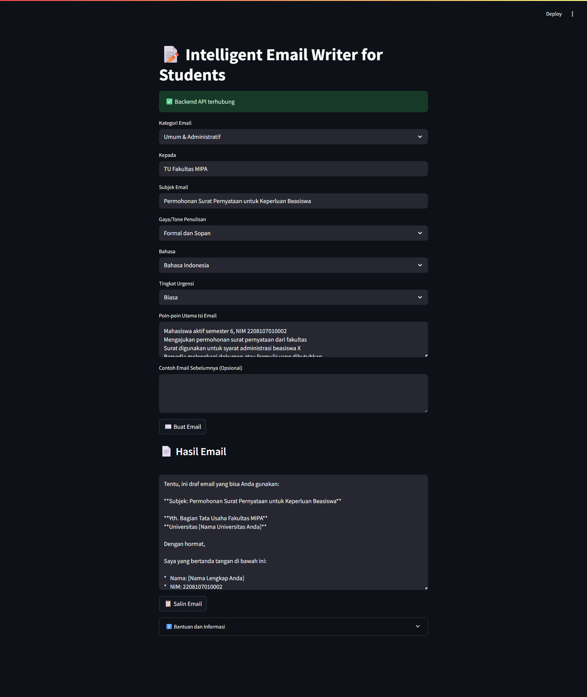

# 📝 Intelligent Email Writer for Students

**Intelligent Email Writer for Students** adalah aplikasi berbasis Web yang membantu mahasiswa membuat email resmi secara otomatis dan profesional dengan memanfaatkan teknologi LLM dari Gemini API.

---

## 📦 Fitur Utama

- ✅ Memilih kategori email: Akademik, Skripsi, Magang, dan lainnya.
- ✅ Menentukan gaya/tone penulisan: Formal, Netral, atau Santai.
- ✅ Mendukung Bahasa Indonesia dan Bahasa Inggris.
- ✅ Memasukkan poin-poin utama isi email.
- ✅ Menghasilkan email profesional, jelas, dan padat secara otomatis.

---

## 📁 Struktur Proyek

```
intelligent_email_writer/
├── .env                     # Berisi API Key Gemini
├── app.py                   # Frontend dengan Streamlit
├── backend/
│   └── main.py              # Backend API menggunakan FastAPI
├── output/
│   └── output.png           # Contoh output email yang dihasilkan
├── requirements.txt         # Dependensi backend
└── .gitignore               # File untuk mengabaikan file tertentu di Git
```

---

## ⚙️ Instalasi dan Menjalankan Proyek

### 1. Kloning Repository

```
git clone https://github.com/milalestari/UAS_MilaLestari_2208107010002.git
cd UAS_MilaLestari_2208107010002
```

### 2. Setup dan Jalankan Backend (FastAPI)

```
# Buat dan aktifkan environment
python3 -m venv env
source env/bin/activate   # Linux/macOS
env\Scripts\activate      # Windows

# Install dependencies
pip install -r requirements.txt

# Jalankan server FastAPI
uvicorn backend.main:app --reload --host 0.0.0.0 --port 8000
```

### 3. Setup dan Jalankan Frontend (Streamlit)

> Jalankan di terminal baru:

```
# Pastikan berada di direktori utama
streamlit run app.py
```

---

## 🔐 Konfigurasi API Key Gemini

1. Buka [Google AI Studio](https://aistudio.google.com/app/apikey)
2. Klik **Create API Key**
3. Salin API Key, lalu simpan ke file `.env` di root proyek dengan format berikut:

```
GEMINI_API_KEY=your_api_key_here
```

---

## 📬 Contoh Penggunaan

1. Pilih kategori dan gaya penulisan email.
2. Masukkan informasi penerima, subjek, dan poin-poin penting isi email.
3. Klik tombol **"Buat Email"**
4. Email hasil generate akan ditampilkan secara otomatis di bawahnya.
5. Gunakan tombol **"Salin Email"** untuk menyalin isi ke clipboard.

---

## 🖼️ Tampilan Antarmuka Aplikasi

### Formulir Input dan Hasil Generate Email



---


